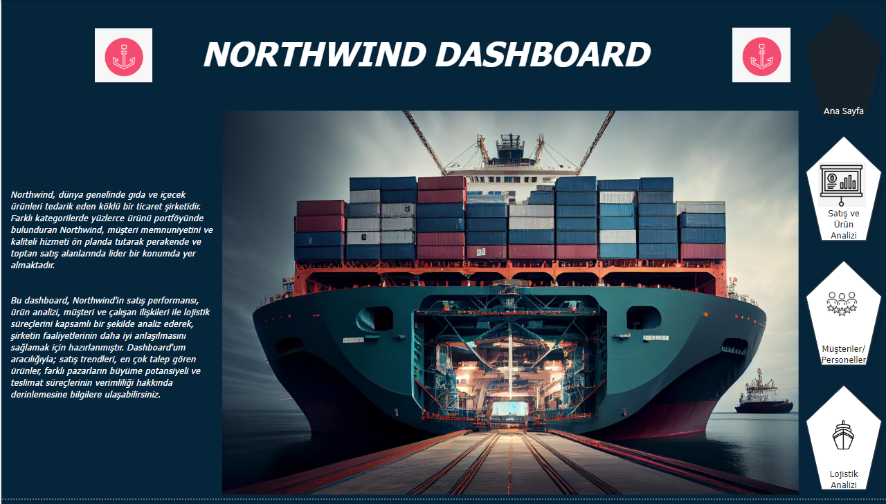
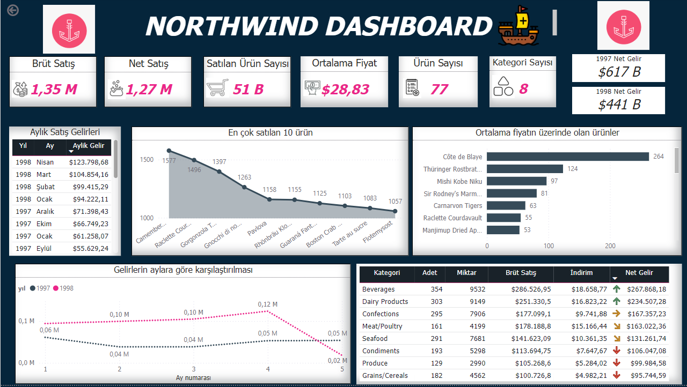
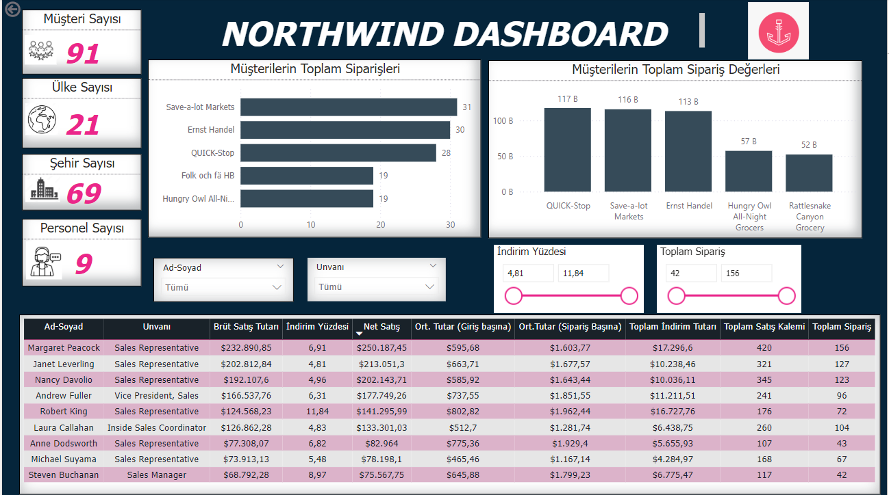
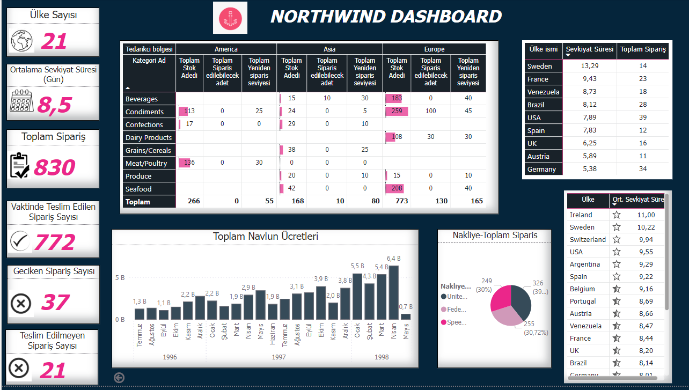

# 🚢 Northwind_Analysis
Bu proje, Northwind veritabanını kullanarak SQL, Python ve Power BI ile analizler yapmayı kapsamaktadır.

** 📋 Genel Tanıtım:**
Northwind şirketine genel bir bakış sağlayan bu görselde satış performansı, müşteri ilişkileri ve lojistik süreçlerin genel bir özetini görebilirsiniz.

**Satış ve Ürün Analizi:**
Bu dashboard, Northwind'in satış performansı ve ürün analiziyle ilgilidir. Brüt ve net satışlar, en çok satılan ürünler ve gelirlerin aylık değişimi gibi kritik metriklere yer verilmiştir. Ayrıca, kategorilere göre ürün adetleri ve indirim etkilerini de içermektedir.

**Müşteri ve Sipariş Analizi:**
Bu dashboard, müşteri davranışları ve sipariş verilerine odaklanmaktadır. Müşteri sayısı, ülke ve şehir bazlı analizler, en çok sipariş veren müşteriler ve indirim oranlarına göre sipariş detayları gibi metrikler bu panelde sunulmuştur.

**Lojistik ve Stok Analizi:**
Bu panel, Northwind'in lojistik ve stok yönetimini detaylandırmaktadır. Ülkeler arası sevkiyat süreleri, toplam sipariş adetleri, kategorilere göre stok düzeyleri ve navlun ücretleri gibi lojistik performansı gösteren veriler bulunmaktadır.

