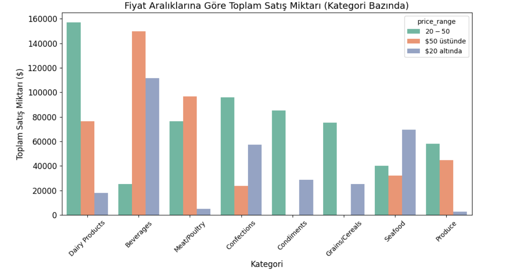
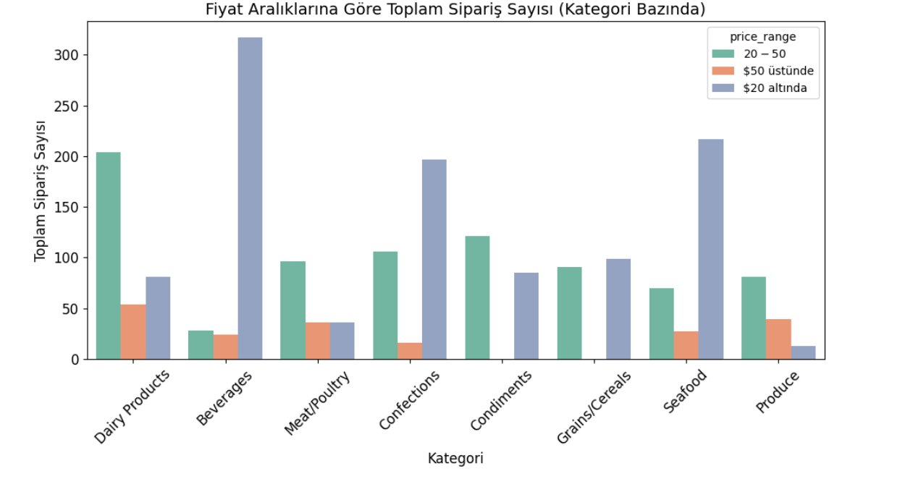
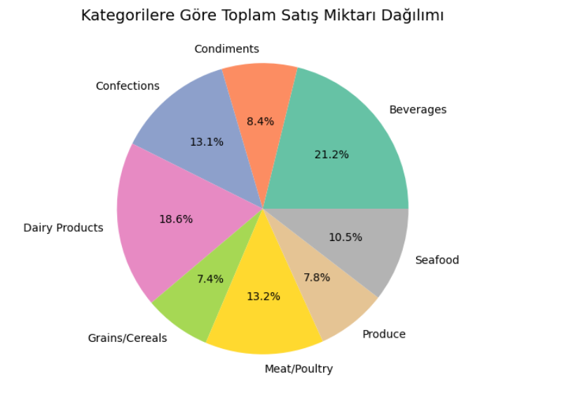
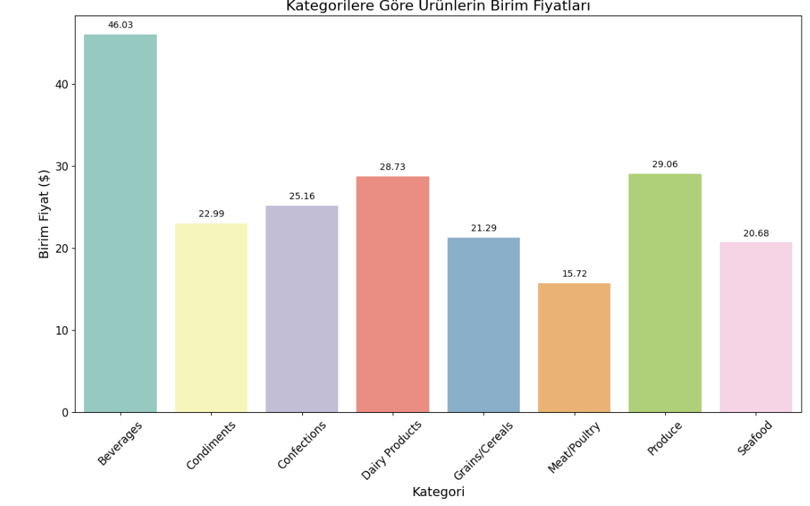
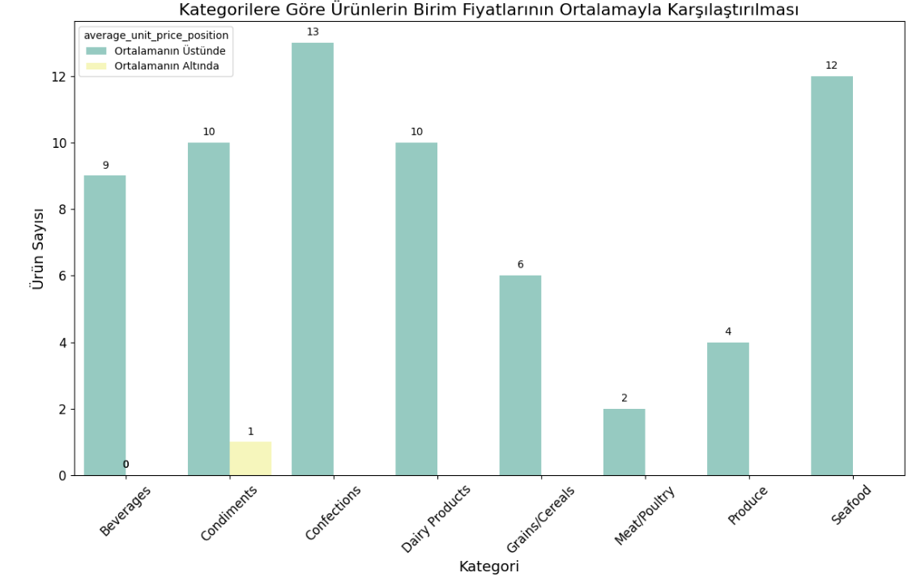

# Python Analizi

Bu dosyada Python kullanılarak yapılan analizler ve görseller yer almaktadır.

## 1. Ürün Fiyat Analizi
Bu sorgu, birim fiyatı 20 ile 50 arasında olan ürünlerin listesini içermektedir. Ürünlerin sıralaması en yüksek fiyattan başlayarak yapılmıştır.

### Analiz Sonuçları:
Gerçekleştirdiğim bu analizde, ürünlerin ortalama satış fiyatının 20-50 dolar aralığında yoğunlaştığını gözlemledim. Bu aralıkta yer alan ürünlerin, sürekli satışta olan ve müşteriler tarafından sıklıkla tercih edilen ürünler olduğunu söylemek mümkün.

Özellikle **[Şekerli Tartı]** ürününün, yaklaşık 49 dolarlık bir fiyatla bu aralığın en üst seviyelerinde yer alması dikkat çekici. **[İpoh Kahve]** gibi diğer popüler ürün ise bu aralıkta daha uygun fiyatlarla sunuluyor. Yine bu fiyat aralığında ürün çeşitlerini artırmak veya ürünlerin özelliklerini geliştirmek faydalı olabilir. 

Ayrıca, ortalamanın üzerindeki fiyatlardan satışa çıkan ürünler ve satış miktarlarıyla alakalı esneklikler göz önüne alınabilir.

---

## 2. Kategori ve Fiyat Aralığı Performansı

Ürünlerin farklı fiyat aralıklarındaki satış performanslarını ve müşteri tercihlerini daha iyi anlamak için hazırladığım 2 grafik var. Özellikle süt ürünleri ve içeceklerin yüksek satış hacimleri dikkat çekiyor. Ayrıca, fiyat aralıklarının satışları nasıl etkilediği de grafiklerde açıkça görülüyor.

### **2.1 Kategorilere Göre Toplam Satış Miktarı** 

Bu grafikte ürün kategorilerine göre farklı fiyat aralıklarındaki toplam satış miktarını dolar cinsinden görebiliriz. 
- Süt ürünleri kategorisi, bu grafikte de en yüksek satış hacmine sahip.
- İçecek kategorisi haricinde 20 ila 50 dolar arası ürünler çoğunlukta. 
- Bu ürünlere odaklanılarak büyümeye devam edilebilir.

---

### **2.2 Kategorilere Göre Toplam Sipariş Sayısı** 

Bu grafikte, ürün kategorilerine göre farklı fiyat aralıklarındaki toplam sipariş sayısını görmekteyiz.
- İçecek ürünleri kategorisinin özellikle 20 dolar altı yüksek bir sipariş sayısına sahip olduğu dikkat çekiyor.
- 50 dolar üstü sipariş sayılarındaki miktarların düşük olduğu görülüyor. 
- Rakip firmaların nasıl bir strateji izlediği araştırılabilir. Ayrıca et kategorisine de odaklanılması gerekebilir.

---

## 3. Kategorilere Göre Toplam Satış Dağılımı 

Hazırladığım pasta grafiği, farklı ürün kategorilerinin toplam satış miktarlarını, fiyat aralıklarından bağımsız olarak göstermektedir.
- Grafikte, tahıllar, taze ürünler, baharat ve sosların diğer kategorilere göre daha düşük satış hacimlerine sahip olduğu açıkça görülmektedir.

---

## 4. Ürün Birim Fiyat Analizi

Her ürünün birim fiyatını, aynı kategorideki ürünlerin ortalama birim fiyatı ile karşılaştırmak için hazırlanan 2 grafiğe aşağıda yer verilmiştir.

### **4.1 Kategorilere Göre Ürünlerin Birim Fiyatları** 

İlk grafikte, kategorilere göre ürünlerin birim fiyatları incelenmiştir.
- İçecek kategorisi, en yüksek birim fiyata sahip olan kategori olarak dikkat çekiyor. 
- Bu kategoriye ait ürünler, diğer kategorilere kıyasla belirgin şekilde yüksek fiyatlarla listeleniyor.

---

### **4.2 Ürünlerin Birim Fiyatlarının Kategori Ortalamaları ile Karşılaştırılması** 

Bu grafikte, her ürünün birim fiyatı, aynı kategorideki ürünlerin ortalama birim fiyatlarıyla karşılaştırılmıştır.
- Özellikle **Tatlılar** ve **Deniz Ürünleri** kategorileri, ortalamanın biraz üzerinde yer alıyor. 
- **Baharat ve Soslar** kategorisinde ise ortalamanın altında fiyatlandırılmış ürünler, daha rekabetçi bir strateji izlendiğine işaret ediyor.

