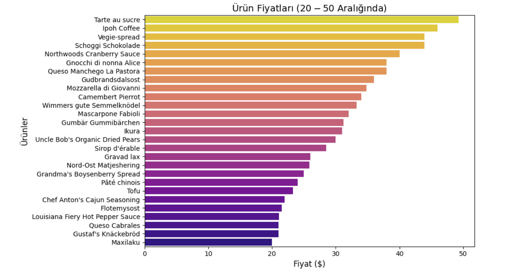

# Python Analizi

Bu dosyada Python kullanılarak yapılan analizler ve görseller yer almaktadır.

## 1. Ürün Fiyat Analizi
Bu sorgu, birim fiyatı 20 ile 50 arasında olan ürünlerin listesini içermektedir. Ürünlerin sıralaması en yüksek fiyattan başlayarak yapılmıştır.

### Çıktı:

### Analiz Sonuçları:
Gerçekleştirdiğim bu analizde, ürünlerin ortalama satış fiyatının 20-50 dolar aralığında yoğunlaştığını gözlemledim. Bu aralıkta yer alan ürünlerin, sürekli satışta olan ve müşteriler tarafından sıklıkla tercih edilen ürünler olduğunu söylemek mümkün.

Özellikle **[Şekerli Tartı]** ürününün, yaklaşık 49 dolarlık bir fiyatla bu aralığın en üst seviyelerinde yer alması dikkat çekici. **[İpoh Kahve]** gibi diğer popüler ürün ise bu aralıkta daha uygun fiyatlarla sunuluyor. Yine bu fiyat aralığında ürün çeşitlerini artırmak veya ürünlerin özelliklerini geliştirmek faydalı olabilir. 

Ayrıca, ortalamanın üzerindeki fiyatlardan satışa çıkan ürünler ve satış miktarlarıyla alakalı esneklikler göz önüne alınabilir.
